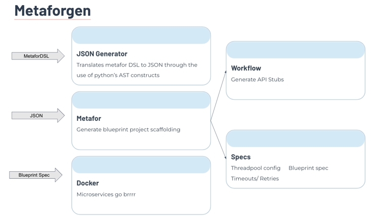

# Metaforgen
A toolchain to bridge high-level performance modeling for metastability ([Metafor](https://github.com/mpi-sws-rse/metafor/tree/main/metafor)) with concrete microservice deployments ([Blueprint](https://github.com/Blueprint-uServices/blueprint)).

## How it works


## Running Metaforgen Plugin
1. Make sure docker daemon is up and running and Go is installed
2. Add sample Metafor DSL in example-dsl.py file at the root
3. Execute (from `metaforgen/`)
   ```sh
   sh run.sh
   ```
4. Once the script has run, your emulator should be started on docker. You will also find the generated JSON from the DSL in config.json file at root


## Repository Structure

```graphql
.
├── metaforgen/         # Blueprint plugin implementation for Metafor
├── metafor-json/       # Python program to convert Metafor DSL into JSON
├── experimentation/    # Load generator and visualization scripts
│   └── results/        # Output CSV files and plots from our experiments
```

## Experimentation

Ensure you are in the correct directory before running commands.

### Setting up a Python Virtual Environment (from root)

1. **Create a virtual environment (venv):**

   ```bash
   python3 -m venv venv
   ```

2. **Activate the virtual environment:**

    - On **Linux/macOS**:
      ```bash
      source venv/bin/activate
      ```
    - On **Windows**:
      ```bash
      venv\Scripts\activate
      ```

3. **Install dependencies:**

   ```bash
   pip install -r ./experimentation/requirements.txt
   ```

4. *(Optional)* **Deactivate the virtual environment when done:**

   ```bash
   deactivate
   ```

### Process followed to replicate results from Analysing Metastability Failures Paper (Section 4)

#### Sample Request Response Example DSL from the Paper (present in experiment-dsl.py files)

```python
api = { 'insert ': Work (10 , [] ,) }
server = Server ('simple', api, qsize=150, thread_pool=1)
src = Source ('client', 'insert', rate=5, timeout=5, retries=5)

p = Program('SimpleService')
p.add_server(server).add_source(src).connect ('client', 'simple')
```

1. Create & Run Blueprint based emulator with queue size 150 (from `metaforgen/`)
   ```sh
      sh run.sh ../experiment-dsl-150.py
   ```

2. Run Loadgen once the emulator is up and running (from `experimentation/`)
   ```bash
   go run loadgen.go -normalRPS=5 -triggerRPS=15 -timeout=5s -duration=100s -triggerDuration=30s -out=results-150.csv -retries=5
   ```

3. Create & Run Blueprint based emulator with queue size 35 (from `metaforgen/`)
   ```sh
      ./metaforgen/run.sh ../experiment-dsl-35.py
   ```

4. Run Loadgen once the emulator is up and running (from `experimentation/`)
   ```bash
   go run loadgen.go -normalRPS 5 -triggerRPS 15 -timeout 5s -duration 100s -triggerDuration 30s -out results-35.csv -retries 5
   ```

5. Generate Plots by running the meta.py script passing in the the result files (from `experimentation/`)
   ```bash
   python3 meta.py results-150.csv

   ```

   ```bash
   python3 meta.py results-35.csv
   ```

